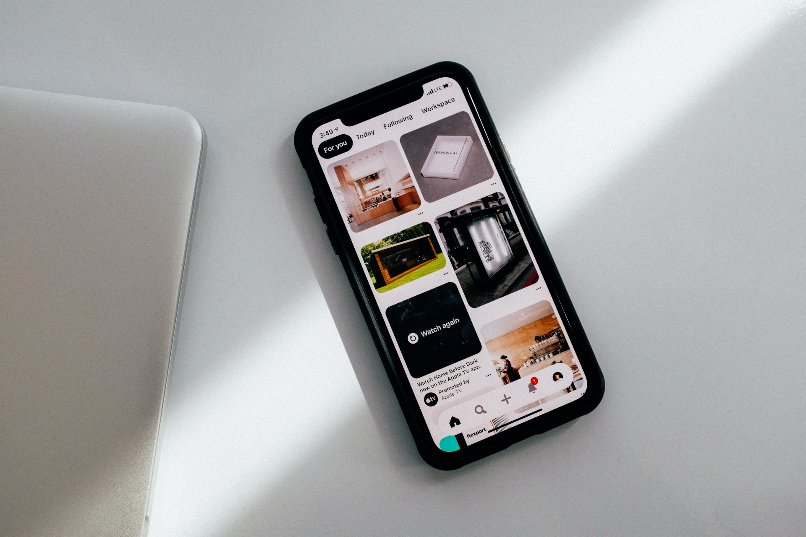
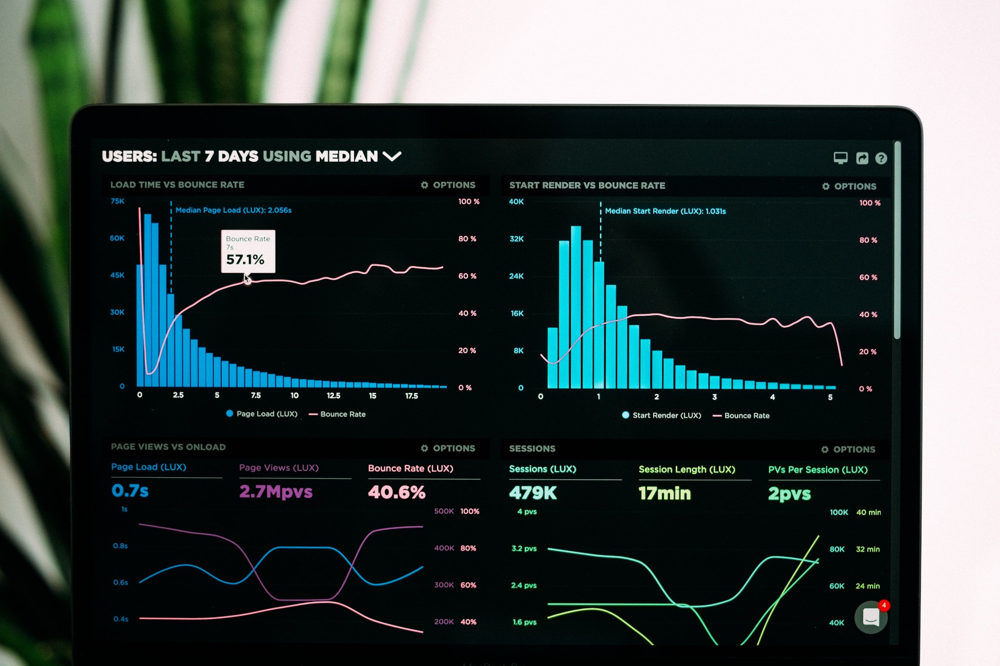

This was my first project and I very proud of it. It helpt my client to earn lots of money,
improve his customers life and make this world a better place.

I started from mobile app interface design:

Then I made this nice dashboard with fancy graps:

To finish I tweaked all this to fit one style:

