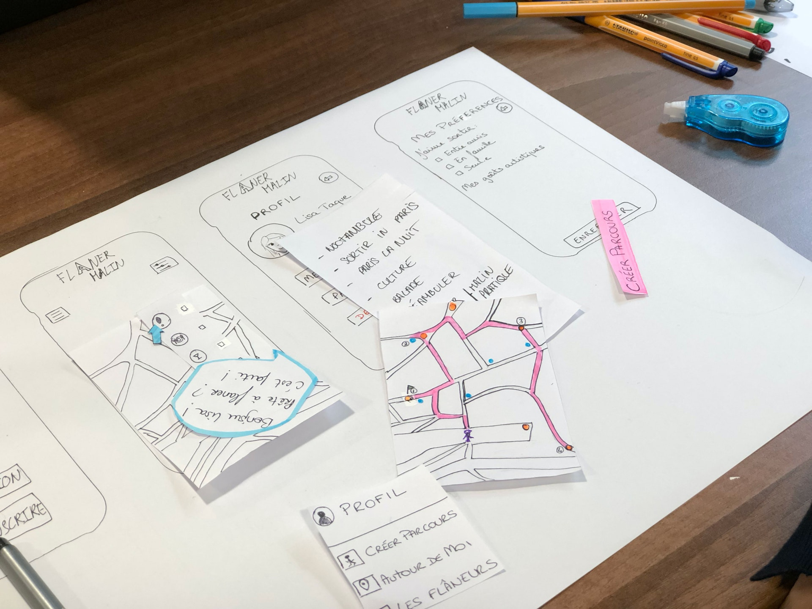
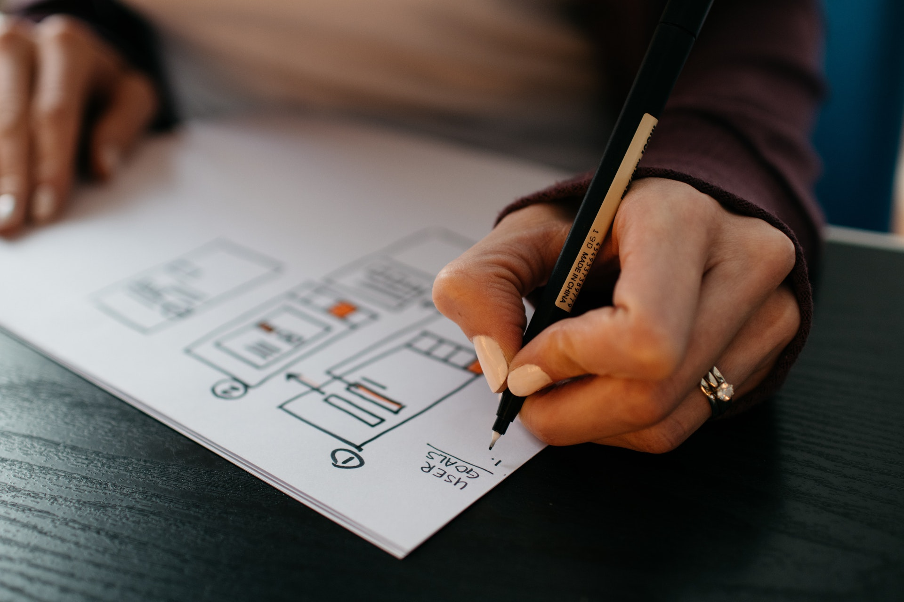
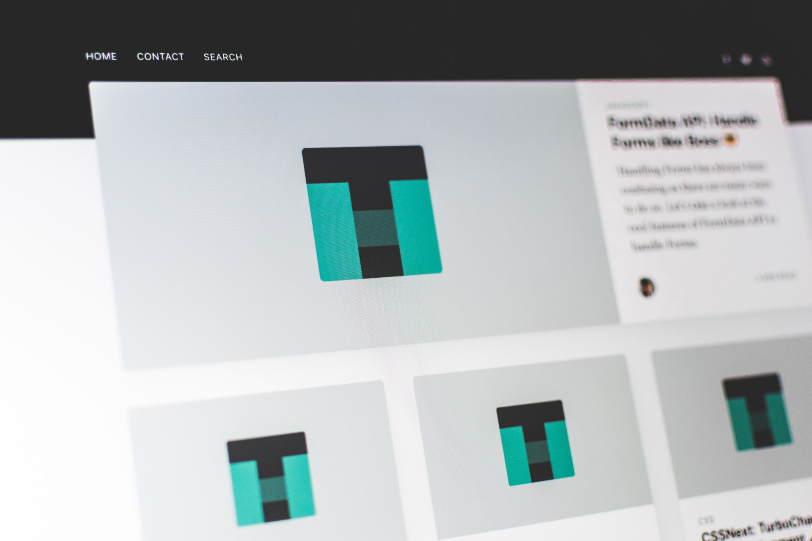

At first I made a sketch with layout of mobile version of this app. Usually I'm using Sketch but for latest project I started to use Figma. Output files can be in any format client wants, since I can just export it.

Also I added beautiful and useful transition animations. Not too flashy, but it makes moving between app sections more smooth and nice to look

Then I made desktop version of project page to make a guide for new users

